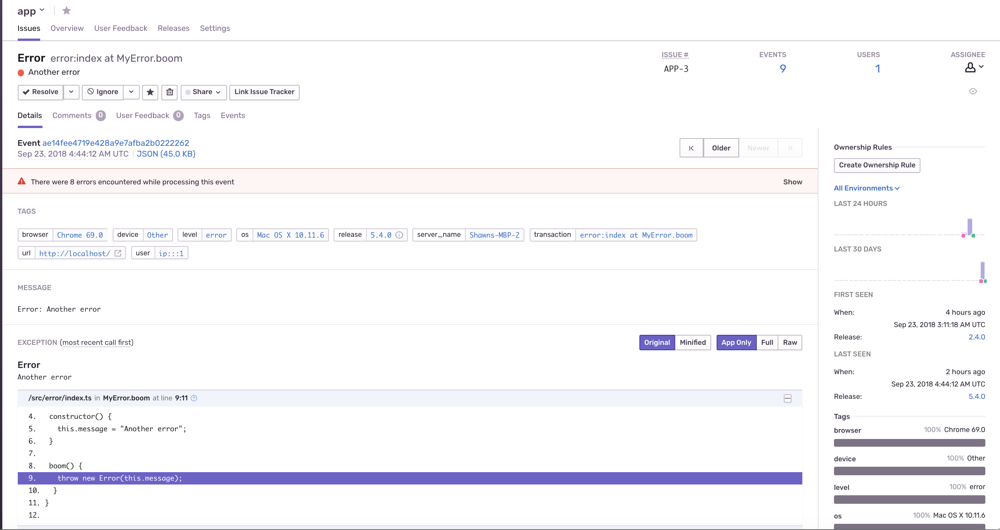

## TypeScript + Sentry = <3

This is a demo app in TS reporting errors to sentry, with source map enabled.



## Setup

1. You will need to have a working sentry cluster first. See [sentry](sentry/) for how to run sentry locally and on kubernetes.

2. Set your env variables:

```
export SENTRY_AUTH_TOKEN=..
export SENTRY_URL=..
export SENTRY_DSN=..
```

3. `npm run release`
